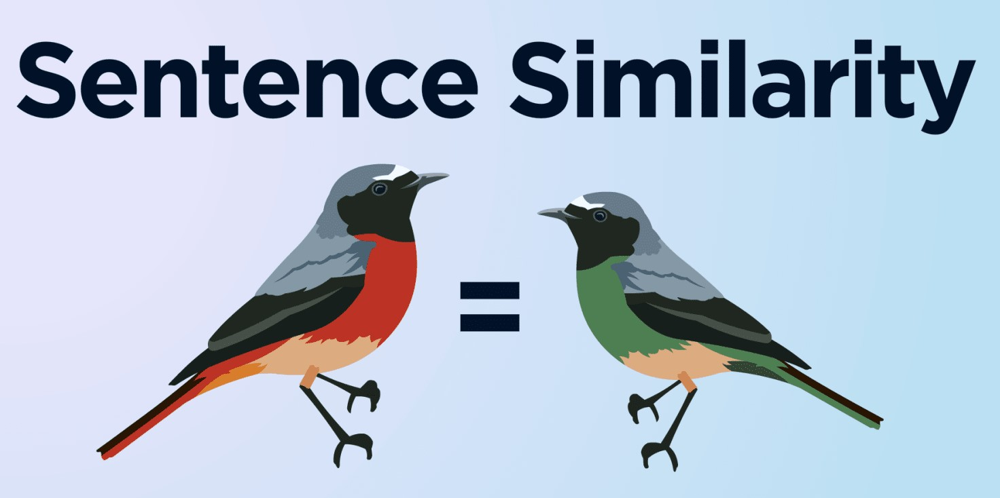

<p align="center">
  
</p>


[sentencesimilarity](https://pypi.org/project/sentencesimilarity/)  is a Python library that calculates similarity between given sentences list.

## Installation

Use the package manager [pip](https://pip.pypa.io/en/stable/) to install foobar.

```bash
pip install sentencesimilarity
```

## Usage

```python
from sentencesimilarity import sentences_similarity

# call SentenceSimilarity class with the parameter model name
sentenceSimilarity = sentences_similarity.SentenceSimilarity("your_transformers_model")

# define your sentences as list
sentences = ['Python is the best programming language!',
             'I literally love programming Python.',
             'Fenerbahce will be the champion this season.'
            ]

# Calculates the similarity of the first sentence with other sentences 
print(sentencecSimilarity.calculate_similarities(sentences))

# Return most similar sentence
print(sentencecSimilarity.return_most_similar(sentences)
```

## Contributing
Pull requests are welcome. For major changes, please open an issue first to discuss what you would like to change.

Please make sure to update tests as appropriate.

## License
[MIT](https://choosealicense.com/licenses/mit/)
